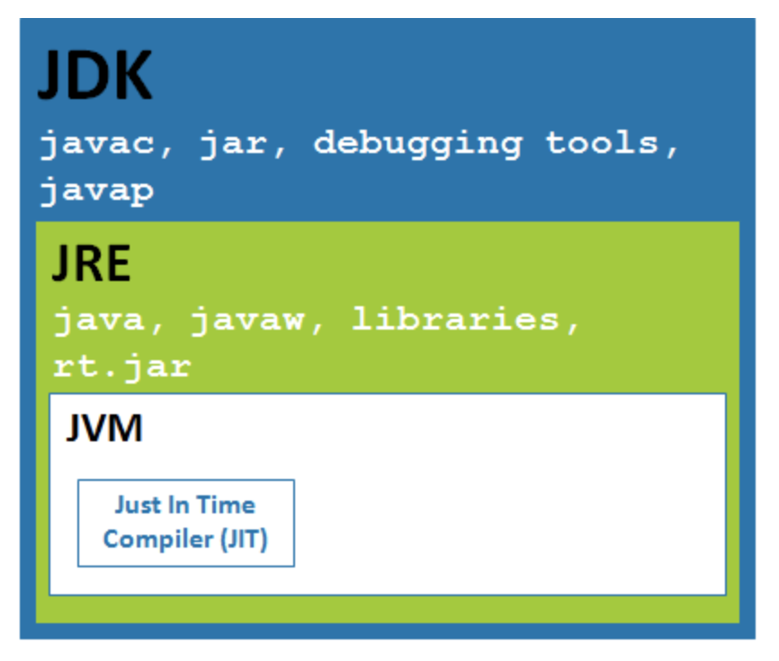

#### 全称
- JRE： Java Runtime Environment
- JDK：Java Development Kit 
- JVM: Java Virtual Machine

#### 基本概念
- JDK: 即java开发工具包，是程序员使用java语言编写java程序所需的开发工具包，是提供给程序员使用的。JDK包含了JRE，javac，还包含很多java程序调试和分析的工具：jconsole，jvisualvm等工具软件，还包含了java程序编写所需的文档和demo例子程序。
- JRE是java运行时环境，包含了java虚拟机，java基础类库。是使用java语言编写的程序运行所需要的软件环境，是提供给想运行java程序的用户使用的。
- JVM（Java虚拟机）是一个抽象机器。 它是一个规范，提供可以执行java字节码的运行时环境。

#### 包含关系
- JDK包括编译器（javac.exe）、开发工具（javadoc.exe、jar.exe、keytool.exe、jconsole.exe）和更多的类库（如tools.jar）
- JRE包括JVM虚拟机（java.exe等）和基本的类库（rt.jar等）

#### 关系图
 
   
    
   
##### 参考资料
- https://www.linkedin.com/pulse/understanding-difference-between-jdk-jre-jvm-important-kumar
- https://www.geeksforgeeks.org/differences-jdk-jre-jvm/
