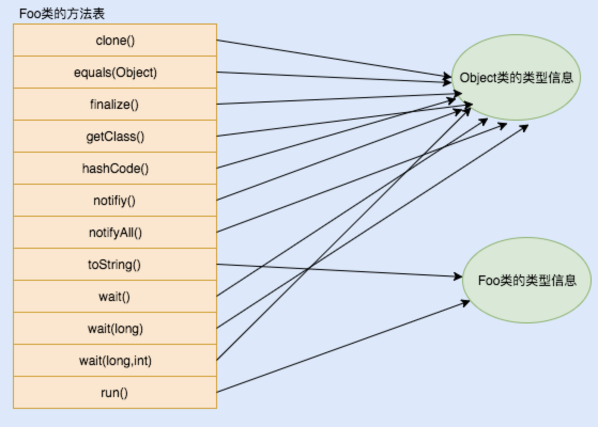
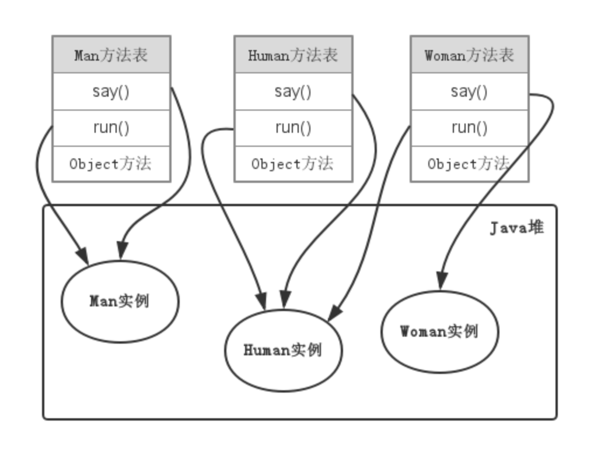

#### 对多态的理解
 

**多态（Polymorphism）是两个希腊语单词的组合，Poly and morphs，Poly意思是许多，morphs是形态，把他们组合在一起，就是许多形态（多态）**

#### Java中有两种形式的多态：
1. 编译时多态（静态绑定）
2. 运行时多态（动态绑定）

<br />
编译时多态，与编译器有关，是指在编译期间，就决定了将来要调用的目标方法。可以通过方法重载的方式实现，即通过在一个类里面实现多个同名的方法，但方法的参数个数或参数类型不同。java编译器通过检查方法的参数类型，即可知道要调用的方法。比如add(int x, int y)和add(int x, int y, int z)，方法名相同，但参数不同。
```
class AddNumbers {

    public int addition(int x, int y){
        return x+y;
    }
    
    public int addition(int x, int y, int z){
        return x+y+z;
    }
    
    public int addition(double x, int y){
        return (int)x+y;    
    }
    
    public static void main(String args[]){
        AddNumbers a1 = new AddNumbers();
        System.out.println(a1.addition(1,2));
        System.out.println(a1.addition(1,2, 3));
        System.out.println(a1.addition(3,4));
    }
}
```
<br />
可以看到有三个同名方法，但结果不同，这就是编译时多态。编译时多态多与Overloading相关。
<br />
运行时多态，在java中，通常用overriding和继承来解释它。子类和父类，有同名同参的方法，当java编译器寻找一个方法时，发现父类和子类都存在这个方法，所以编译器就不知道要执行哪个方法。只能当程序运行起来，由JVM来决定执行哪个方法。
<br />
举例说明
```
// 父类
class Animal {
	void run() {
		System.out.println("animal is running...");
	}

	void eat() {
		System.out.println("animal is eatting...");
	}
}

// 子类
class Dog extends Animal {
	@Override
	void run() {
		System.out.println("dog is running...");
	}
}

public class AnimalDemo {

	public static void main(String[] args) {
		Animal dog = new Dog();
		dog.run();
		dog.eat();
	}
}
```
输出
```
dog is running...
animal is eatting...
```
运行后，因为子类覆盖了父类方法，所以JVM会执行子类方法，这就是运行时多态，它是在运行时发生的。
<br />
#### 注意事项：
1. static方法不能override
2. private方法不能override
3. final方法不能override
4. 属性变量不能override，只能是方法。举例animal->dog

<br />
运行时多态在jvm中的实现机制
方法表 / 虚方法表，
jvm结构
虚方法表在类加载的连接阶段进行初始化，存放着各个方法的实际入口地址，如果某个方法在子类中没有被重写，那么子类的虚方法表中该方法的入口地址和父类保持一致。

#### invokeVirtual指令：
1. 找到操作数栈的栈顶元素所指向的对象的实际类型，记为C；
2. 如果C中存在描述符和简单名称都相符的方法，则进行访问权限验证，如果验证通过，则直接返回这个方法的直接引用，否则返回java.lang.IllegalAccessError异常；
3. 如果C中不存在对应的方法，则按照继承关系对C的各个父类进行第2步的操作；
4. 如果各个父类也没对应的方法，则返回异常；
<br />
JVM是通过继承关系从子类往上查找的对应的方法的，为了提高动态分派时方法查找的效率，JVM为每个类都维护一个虚方法表。
<br />
一个类的方法表包含类的所有方法入口地址，从父类继承的方法放在前面，接下来是接口方法和自定义的方法。如果某个方法在子类中没有被重写，那子类的虚方法表里面的地址入口和父类相同的方法的入口地址一致。如果子类重写了这个方法，子类方法表中的地址将会替换为指向子类实现版本的入口地址。
<br />
invokevirtual和invokeinterface指令调用的方法是在运行时确定具体的方法地址


#### 单分派&多分派
单分派和多分派取决于宗量,  方法调用者和方法参数都是宗量.
<br />
Java中静态分派的方法调用,首先确定调用者的静态类型是什么,然后根据要调用的方法参数的静态类型(声明类型)确定所有重载方法中要调用哪一个, 需要根据这两个宗量来编译, 所以是静态多分派(多个宗量确定).
<br/>
Java中动态分派的方法调用,在运行期间,虚拟机会根据调用者的实际类型调用对应的方法, 秩序根据这一个宗量就可以确定要调用的方法,所以是动态单分派(一个宗量)
 

<br />
<br />

参考文献：
https://blog.csdn.net/u013991521/article/details/52439638
https://www.jianshu.com/p/56a7c4b26b14
https://blog.csdn.net/TellH/article/details/77370223
https://salitha94.blogspot.com/2018/03/polymorphism-in-java.html
https://blog.csdn.net/kingzma/article/details/40152283
https://www.geeksforgeeks.org/dynamic-method-dispatch-runtime-polymorphism-java/




